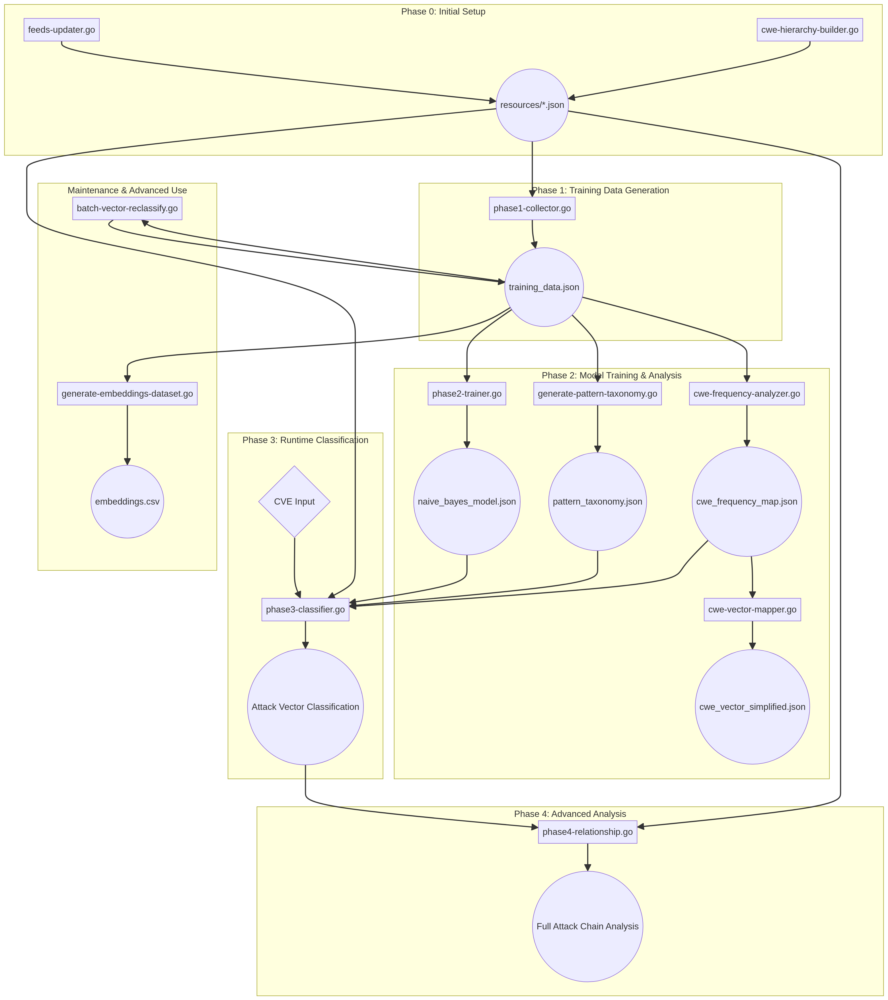

# CWE/CVE Analysis Pipeline - Complete Guide

This document provides a comprehensive guide to the CWE/CVE analysis pipeline, a suite of Go programs designed for collecting, processing, and analyzing vulnerability data from multiple security knowledge bases. The system combines data from MITRE (CWE, CAPEC, ATT&CK) with the National Vulnerability Database (NVD) to create a sophisticated machine learning pipeline for vulnerability classification and threat analysis.

---

## System Overview

The pipeline consists of **11 interconnected components** that work together to transform raw vulnerability data into actionable intelligence. The system is designed to be run in a specific sequence, with each component building upon the outputs of previous stages.

The pipeline serves three primary purposes:

1. **Data Collection & Preparation**: Downloading and structuring security knowledge bases from authoritative sources
2. **Machine Learning Training**: Building probabilistic and pattern-based models for vulnerability classification
3. **Runtime Analysis**: Classifying new vulnerabilities and mapping them to attack patterns and techniques

---

## Visual Workflow



The diagram above illustrates the complete data flow through the pipeline, from initial setup through runtime classification and maintenance.

---

## Sequence of Usage

### Phase 0: Initial Setup (Run Once or When Updating Knowledge Bases)

This phase downloads and processes all necessary security knowledge bases. Run these components initially to set up the environment, or periodically (e.g., monthly) to refresh the core databases.

#### 1. **feeds-updater**

**What it does**: Downloads and processes the latest CWE, CAPEC, and MITRE ATT&CK data from official sources.

**Why it's important**: This is the foundation of the entire pipeline. It creates stable, version-agnostic datasets from authoritative sources that all other components depend on. Without this step, the system has no knowledge base to work with.

**How it works**: The program executes four main stages in sequence. First, it downloads the latest CWE XML archive from MITRE, extracts it, parses the XML structure, and builds a comprehensive JSON database that includes weakness descriptions, parent-child relationships, and links to CAPEC attack patterns. It also constructs a specialized `cwe_hierarchy.json` file that maps each CWE to its associated attack vectors using a predefined mapping of 260+ CWE-to-vector relationships.

Second, it downloads and processes the CAPEC XML archive, extracting detailed information about each attack pattern including execution flows, prerequisites, skill requirements, consequences, and relationships to both CWEs and ATT&CK techniques.

Third, it downloads STIX 2.1 JSON bundles for all three MITRE ATT&CK domains (Enterprise, Mobile, and ICS) from the official GitHub repository. It processes thousands of STIX objects including techniques, sub-techniques, threat actor groups, malware/tools, and mitigations, along with all the relationships between them.

Finally, it builds a comprehensive `relationships_db.json` file that provides bidirectional mappings between all three frameworks (CWE ↔ CAPEC ↔ ATT&CK), enabling powerful cross-framework queries and analysis.

**Inputs**: 
- External URLs (no local files required)
  - `http://cwe.mitre.org/data/xml/cwec_latest.xml.zip`
  - `https://capec.mitre.org/data/archive/capec_latest.zip`
  - `https://raw.githubusercontent.com/mitre-attack/attack-stix-data/master/*/` (Enterprise, Mobile, ICS)

**Outputs**:
- `resources/cwe_db.json` - Complete CWE database with descriptions and relationships
- `resources/cwe_hierarchy.json` - CWE hierarchy with attack vector mappings (260+ CWEs mapped to 35 attack vectors)
- `resources/capec_db.json` - CAPEC attack patterns database
- `resources/attack_techniques_db.json` - ATT&CK techniques from all domains
- `resources/attack_groups_db.json` - Threat actor groups and their TTPs
- `resources/attack_software_db.json` - Malware and tools database
- `resources/attack_mitigations_db.json` - Mitigation strategies
- `resources/relationships_db.json` - Cross-framework relationship mappings
- `resources/metadata.json` - Update timestamp and version information

**Usage**:
```bash
./feeds-updater
```

**Key Features**:
- Uses stable, version-agnostic URLs that don't break when new versions are released
- Processes all three ATT&CK domains (Enterprise, Mobile, ICS) into a unified dataset
- Creates bidirectional relationship mappings for efficient queries
- Includes 35 predefined attack vectors across 3 priority tiers (Critical, High, Medium)

---

#### 2. **cwe-hierarchy-builder** (Optional/Standalone)

**What it does**: Builds the CWE hierarchical structure from the official CWE XML data.

**Why it's important**: While this functionality is integrated into `feeds-updater`, this standalone version can be useful for testing or when you only need to rebuild the hierarchy without downloading all other data.

**How it works**: It downloads the CWE XML archive, parses the parent-child relationships defined by the "ChildOf" nature in the RelatedWeaknesses section, and constructs a tree structure that represents the CWE taxonomy. This allows the classifier to understand that, for example, CWE-89 (SQL Injection) is a child of CWE-74 (Injection).

**Inputs**: 
- CWE XML from MITRE (downloaded automatically)

**Outputs**:
- `resources/cwe_hierarchy.json` - Hierarchical CWE structure with parent/child relationships

**Usage**:
```bash
./cwe-hierarchy-builder
```

---

### Phase 1: Training Data Collection (Run Periodically)

This phase collects real-world CVE data from the NVD to create a labeled training dataset. Run this monthly or quarterly to keep the training data current.

#### 3. **phase1-collector**

**What it does**: Downloads CVE data from the National Vulnerability Database (NVD) and transforms it into a structured training dataset.

**Why it's important**: This component bridges the gap between the theoretical knowledge bases (CWE, CAPEC) and real-world vulnerabilities. It creates the labeled examples needed to train machine learning models by mapping actual CVE descriptions to their associated CWEs and attack vectors.

**How it works**: The program downloads the NVD JSON feed for a specific year (default: 2024), which contains thousands of CVE records. For each CVE, it extracts the English description and the associated CWE IDs. It then uses a predefined mapping table to convert each CWE into one or more attack vectors. For example, if a CVE is tagged with CWE-89, it gets mapped to the "sql_injection" attack vector. The program handles multi-label classification, as a single CVE can be associated with multiple CWEs and therefore multiple attack vectors.

The attack vector mapping is organized into three priority tiers. Tier 1 (Critical) includes 10 high-impact vectors like XSS, SQL injection, RCE, and command injection. Tier 2 (High Priority) includes 10 vectors like CSRF, XXE, and buffer overflow. Tier 3 (Medium Priority) includes 15 vectors like DoS, open redirect, and race conditions. This tiered approach ensures that the most dangerous attack types are well-represented in the training data.

**Inputs**:
- NVD JSON feeds (downloaded automatically)
  - Default: `https://nvd.nist.gov/feeds/json/cve/2.0/nvdcve-2.0-2024.json.gz`
  - Falls back to 1.1 format if 2.0 is unavailable

**Outputs**:
- `resources/training_data.json` - Structured training dataset with CVE ID, description, CWEs, attack vectors, and publication date

**Usage**:
```bash
./phase1-collector
```

**Configuration** (edit source code):
- `year := 2024` - Change this to collect data from different years
- `outputFile := "resources/training_data.json"` - Output path

**Attack Vector Categories** (35 total):
- **Tier 1 (Critical)**: xss, sql_injection, rce, command_injection, path_traversal, ssrf, deserialization, auth_bypass, authz_bypass, file_upload
- **Tier 2 (High)**: csrf, xxe, ldap_injection, jndi_injection, privilege_escalation, buffer_overflow, idor, http_desync, hardcoded_credentials, info_disclosure
- **Tier 3 (Medium)**: dos, nosql_injection, xpath_injection, open_redirect, session_fixation, crypto_failure, integer_overflow, use_after_free, null_pointer, format_string, email_injection, race_condition, ssti, input_validation, code_injection

**Output Format**:
```json
[
  {
    "cve_id": "CVE-2024-12345",
    "description": "A SQL injection vulnerability in...",
    "cwes": ["89", "20"],
    "attack_vectors": ["sql_injection", "input_validation"],
    "published_date": "2024-01-15T10:30:00.000"
  }
]
```

---

### Phase 2: Model Training & Pattern Analysis (Run After Data Collection)

This phase uses the collected training data to build the classification models and pattern databases. Run these after collecting new training data.

#### 4. **phase2-trainer**

**What it does**: Trains a Naive Bayes classifier to predict attack vectors from CVE descriptions.

**Why it's important**: This is the core of the text classification engine. The Naive Bayes model learns the probabilistic relationships between words in vulnerability descriptions and attack vector categories, enabling the system to classify new vulnerabilities based purely on their textual descriptions.

**How it works**: The trainer implements a multinomial Naive Bayes classifier with Laplace smoothing. It first tokenizes all CVE descriptions using a sophisticated preprocessing pipeline that converts text to lowercase, removes version numbers (e.g., "2.15.0"), strips CVE IDs, and filters out stopwords and short words. The stopword list includes not just common English words, but also security-specific generic terms like "vulnerability," "attacker," and "allows" that have low discriminative power.

After tokenization, it builds a vocabulary of all unique terms across the training set. For each attack vector, it calculates two key probabilities. First, the prior probability P(vector) represents how common each attack vector is in the training data. Second, the likelihood P(word|vector) represents how likely each word is to appear in descriptions of that attack vector. These likelihoods are calculated using Laplace smoothing: (word_count + 1) / (total_words + vocabulary_size), which prevents zero probabilities for unseen words.

The model also identifies the top discriminative words for each attack vector, which provides valuable insights into what terms are most characteristic of each attack type. For example, the top words for "sql_injection" might include "query," "database," "select," and "union."

**Inputs**:
- `resources/training_data.json` (from phase1-collector)

**Outputs**:
- `resources/naive_bayes_model.json` - Trained model with probabilities and vocabulary

**Usage**:
```bash
./phase2-trainer
```

**Model Components**:
- **Vocabulary**: All unique words (typically 5,000-15,000 terms)
- **Prior Probabilities**: P(vector) for each attack vector
- **Likelihoods**: P(word|vector) for each word-vector pair
- **Word Counts**: Raw frequency data for analysis
- **Top Words**: Most discriminative terms per vector (for debugging/analysis)

**Stopword Filtering**: Removes 100+ common and security-generic terms to improve classification accuracy

**Output Format**:
```json
{
  "attack_vectors": ["xss", "sql_injection", "rce", ...],
  "vector_priors": {
    "xss": 0.0823,
    "sql_injection": 0.0654,
    ...
  },
  "word_given_vector": {
    "xss": {
      "script": 0.00234,
      "javascript": 0.00189,
      ...
    }
  },
  "vocabulary": ["script", "query", "execute", ...],
  "total_documents": 12543
}
```

---

#### 5. **generate-pattern-taxonomy**

**What it does**: Analyzes the training data to identify high-confidence keyword patterns for each attack vector.

**Why it's important**: While the Naive Bayes model provides probabilistic classification, pattern matching offers a complementary approach that is fast, interpretable, and highly accurate for CVEs that contain specific, unambiguous technical terms. This hybrid approach significantly improves overall classification accuracy.

**How it works**: The program uses TF-IDF (Term Frequency-Inverse Document Frequency) analysis to identify terms that are both frequent within a specific attack vector and rare across other vectors. For each attack vector, it groups all CVE descriptions that belong to that category and calculates term frequencies. It then computes the IDF score for each term, which measures how specific that term is to the vector.

The specificity score is calculated as the ratio of the term's frequency in the target vector to its frequency across all vectors. Terms with high specificity (>0.6) and sufficient support (appearing in at least 3 CVEs) are selected as pattern keywords. Each pattern is assigned a boost score that reflects its discriminative power, which is used during classification to increase confidence when these patterns are detected.

The system also includes manually curated critical patterns for high-priority attack vectors to ensure that well-known vulnerability indicators (like "JNDI" for JNDI injection or "union select" for SQL injection) are always recognized.

**Inputs**:
- `resources/training_data.json` (from phase1-collector)

**Outputs**:
- `resources/pattern_taxonomy.json` - Pattern rules with keywords, specificity scores, and boost values

**Usage**:
```bash
./generate-pattern-taxonomy
```

**Configuration** (constants in source):
- `MinTermFrequency = 3` - Minimum times a term must appear
- `MinSpecificity = 0.6` - Minimum specificity threshold (60%)
- `MaxPatternsPerVector = 15` - Maximum patterns to keep per vector
- `MinPatternLength = 3` - Minimum keyword length

**Pattern Scoring**:
- **TF-IDF**: Identifies important terms
- **Specificity**: Measures how unique a term is to a vector (0-1 scale)
- **Boost**: Multiplier applied during classification (typically 1.2-2.0)
- **Support**: Number of CVEs containing the pattern

**Output Format**:
```json
{
  "patterns": {
    "sql_injection": [
      {
        "keywords": ["query", "database", "sql"],
        "specificity": 0.87,
        "boost": 1.8,
        "support": 234
      }
    ]
  },
  "stats": {
    "total_vectors": 35,
    "total_patterns": 412,
    "vector_counts": {...}
  }
}
```

---

#### 6. **cwe-frequency-analyzer**

**What it does**: Analyzes the distribution and frequency of CWEs within the training data.

**Why it's important**: Understanding which CWEs are most common for each attack vector helps prioritize analysis and provides insights into the real-world prevalence of different weakness types. This data is used by the vector mapper to create optimized lookup tables.

**How it works**: The program loads the training data and iterates through all CVE records, counting how many times each CWE appears for each attack vector. It calculates both absolute frequencies (raw counts) and relative frequencies (percentages). It also identifies the top N CWEs for each vector, which represents the most common weaknesses associated with that attack type.

**Inputs**:
- `resources/training_data.json` (from phase1-collector)

**Outputs**:
- Console output with frequency statistics
- Optional: `resources/cwe_frequency_map.json` (if saving is implemented)

**Usage**:
```bash
./cwe-frequency-analyzer
```

**Analysis Provided**:
- Total CWE occurrences per attack vector
- Top CWEs for each vector (ranked by frequency)
- Distribution statistics
- Coverage analysis (what percentage of CVEs have CWE tags)

---

#### 7. **cwe-vector-mapper**

**What it does**: Creates a simplified, frequency-based mapping from CWEs to attack vectors.

**Why it's important**: This provides a fast lookup table that can be used for quick CWE-to-vector translation without running the full classification pipeline. It's particularly useful for cases where you already have CWE IDs and just need to know the associated attack vectors.

**How it works**: Using the frequency data from the analyzer, it creates a clean mapping where each CWE is associated with its most common attack vectors, ranked by frequency. This mapping is optimized for speed and can be used as a fallback or primary classification method when CWE IDs are already known.

**Inputs**:
- `resources/cwe_frequency_map.json` (from cwe-frequency-analyzer)

**Outputs**:
- `resources/cwe_vector_simplified.json` - Simplified CWE-to-vector mapping

**Usage**:
```bash
./cwe-vector-mapper
```

**Output Format**:
```json
{
  "89": ["sql_injection"],
  "79": ["xss"],
  "94": ["rce", "code_injection"],
  "502": ["deserialization", "rce"]
}
```

---

### Phase 3: Runtime Classification (Operational Use)

This is the operational phase where you classify individual vulnerabilities in real-time.

#### 8. **phase3-classifier**

**What it does**: Classifies a CVE (by ID or description) into attack vectors and maps it to relevant CAPEC attack patterns.

**Why it's important**: This is the primary operational tool for vulnerability analysts. It takes a CVE identifier or description and produces a ranked list of attack vectors with confidence scores, along with relevant CAPEC patterns that describe how the vulnerability could be exploited.

**How it works**: The classifier uses a sophisticated hybrid approach that combines three classification methods. First, if CWE IDs are available (either from the NVD API or provided via command line), it performs CWE hierarchy lookup by traversing the CWE tree to find all associated attack vectors, including those inherited from parent weaknesses.

Second, it runs Naive Bayes classification on the CVE description. It tokenizes the text, calculates the posterior probability for each attack vector using Bayes' theorem (P(vector|description) ∝ P(vector) × ∏P(word|vector)), and ranks the vectors by probability.

Third, it applies pattern matching using the pattern taxonomy. It scans the description for high-confidence keywords and applies boost scores when matches are found.

The results from all three methods are then combined using a weighted scoring system. The final output is a ranked list of attack vectors with confidence levels (High, Medium, Low) based on the probability scores.

After identifying attack vectors, the classifier maps them to CAPEC patterns using the relationships database. It ranks CAPECs by relevance using a scoring function that considers the strength of the CWE-CAPEC relationship, the frequency of the CWE in the training data, and keyword overlap between the CVE description and CAPEC description.

**Inputs**:
- CVE ID (fetched from NVD API) OR description text + optional CWE IDs
- `resources/cwe_hierarchy.json`
- `resources/naive_bayes_model.json`
- `resources/pattern_taxonomy.json` (optional)
- `resources/cwe_frequency_map.json` (optional)
- `resources/capec_db.json`
- `resources/relationships_db.json`

**Outputs**:
- JSON output to stdout with ranked attack vectors and CAPECs
- Detailed classification process (if verbose mode enabled)

**Usage**:
```bash
# Classify by CVE ID (fetches from NVD)
./phase3-classifier -cve CVE-2021-44228

# Classify by description with known CWEs
./phase3-classifier -d "allows remote attackers to execute arbitrary code via JNDI" -c "502,917"

# Show detailed process
./phase3-classifier -cve CVE-2021-44228 -verbose

# Limit to top 5 results
./phase3-classifier -cve CVE-2021-44228 -top 5
```

**Command-line Flags**:
- `-cve` : CVE ID to fetch and classify
- `-description` or `-d` : CVE description text
- `-cwes` or `-c` : Comma-separated CWE IDs
- `-top` : Number of top results to return (default: 3)
- `-verbose` or `-v` : Show detailed classification process

**Classification Methods**:
1. **CWE Hierarchy Lookup**: Direct mapping from known CWEs
2. **Naive Bayes**: Probabilistic text classification
3. **Pattern Matching**: Keyword-based detection with boost scores

**Confidence Levels**:
- **High**: Probability > 0.7 or strong pattern match
- **Medium**: Probability 0.4-0.7
- **Low**: Probability < 0.4

**Output Format**:
```json
{
  "cve_id": "CVE-2021-44228",
  "description": "Apache Log4j2 allows remote code execution...",
  "cwes": ["502", "917"],
  "attack_vectors": [
    {
      "vector": "jndi_injection",
      "name": "JNDI Injection",
      "probability": 0.94,
      "confidence": "High",
      "source": "hybrid",
      "layer_contributions": ["cwe_hierarchy", "naive_bayes", "patterns"]
    },
    {
      "vector": "rce",
      "name": "Remote Code Execution",
      "probability": 0.89,
      "confidence": "High",
      "source": "hybrid"
    }
  ],
  "capecs": [
    {
      "capec_id": "253",
      "name": "JNDI Injection",
      "probability": 0.91,
      "confidence": "High"
    }
  ]
}
```

---

#### 9. **phase4-relationship**

**What it does**: Extends phase3 classification by mapping results to the MITRE ATT&CK framework, providing a complete attack chain analysis.

**Why it's important**: While CWE describes the weakness and CAPEC describes the attack pattern, ATT&CK describes the adversary tactics and techniques. This component completes the picture by showing how a vulnerability fits into the broader context of an attack campaign, which is essential for threat modeling and defense planning.

**How it works**: It performs all the same classification steps as phase3-classifier, but adds an additional mapping layer. After identifying relevant CAPEC patterns, it uses the relationships database to find all ATT&CK techniques that are associated with those CAPECs. It then enriches the output with detailed information about each technique, including its tactics (e.g., Initial Access, Execution, Persistence), platforms (e.g., Windows, Linux, Cloud), and links to the ATT&CK website.

The classifier also implements intelligent confidence gap filtering. Instead of always showing a fixed number of results, it analyzes the probability distribution and filters results based on the confidence gap. If there's a clear winner (>90% probability), it only shows additional results if they're within 20% of the top score. For medium confidence scenarios (60-90%), it shows the top 3 or until the gap exceeds 30%.

**Inputs**:
- Same as phase3-classifier, plus:
- `resources/attack_techniques_db.json`

**Outputs**:
- JSON output with attack vectors, CAPECs, and ATT&CK techniques
- Full attack chain: CVE → CWE → Attack Vector → CAPEC → ATT&CK Technique

**Usage**:
```bash
# Same syntax as phase3-classifier
./phase4-relationship -cve CVE-2021-44228
./phase4-relationship -d "description" -c "94,502" -verbose
```

**Command-line Flags**: Same as phase3-classifier

**Confidence Gap Filtering**:
- **High Confidence (>90%)**: Show top result + any within 20% gap
- **Medium Confidence (60-90%)**: Show top 3 or until 30% gap
- **Distributed (<60%)**: Show all results

**Output Format**:
```json
{
  "cve_id": "CVE-2021-44228",
  "attack_vectors": [...],
  "capecs": [...],
  "attack_techniques": [
    {
      "technique_id": "T1190",
      "name": "Exploit Public-Facing Application",
      "tactics": ["Initial Access"],
      "platforms": ["Linux", "Windows", "macOS"],
      "url": "https://attack.mitre.org/techniques/T1190/"
    },
    {
      "technique_id": "T1059",
      "name": "Command and Scripting Interpreter",
      "tactics": ["Execution"],
      "platforms": ["Linux", "Windows", "macOS"],
      "url": "https://attack.mitre.org/techniques/T1059/"
    }
  ]
}
```

---

### Maintenance & Advanced Use (As Needed)

These specialized tools help improve the pipeline and enable advanced machine learning applications.

#### 10. **batch-vector-reclassify**

**What it does**: Re-runs the latest classification logic over the entire training dataset to identify and correct misclassifications.

**Why it's important**: As the classification models improve over time (through new patterns, better algorithms, or expanded knowledge bases), the original training data labels may become outdated or incorrect. This tool helps maintain data quality by finding discrepancies between the original labels and what the current models would predict.

**How it works**: It loads the existing training data, then re-classifies each CVE using the current hybrid classification approach (CWE hierarchy + Naive Bayes + patterns). For each CVE, it compares the original attack vector labels with the newly predicted ones. It flags any discrepancies and generates detailed statistics showing how many classifications changed, which vectors were added or removed, and the confidence levels of the new predictions.

The tool can either generate a report of suggested changes (for manual review) or automatically update the training data file with the new classifications. This creates a feedback loop that continuously improves the quality of the training data.

**Inputs**:
- `resources/training_data.json`
- All model files (cwe_hierarchy.json, naive_bayes_model.json, pattern_taxonomy.json)

**Outputs**:
- Updated `resources/training_data.json` (with improved labels)
- Statistics report showing classification changes

**Usage**:
```bash
./batch-vector-reclassify
```

**Analysis Provided**:
- Total CVEs processed
- Number of classifications changed
- Attack vectors added/removed
- Confidence distribution of changes
- Detailed diff for each changed CVE

**Use Cases**:
- Quality assurance for training data
- Identifying systematic labeling errors
- Improving model accuracy through iterative refinement
- Validating new classification algorithms

---

#### 11. **generate-embeddings-dataset**

**What it does**: Generates numerical vector representations (embeddings) of CVE and CAPEC descriptions and exports them to a JSON dataset file.

**Why it's important**: This is a **standalone data export utility** that creates an embeddings dataset for external use or future integration. It is **NOT currently used by the classification pipeline** (phase3/phase4). The embeddings can be used for advanced machine learning applications outside this pipeline, such as semantic search, similarity analysis, clustering, or training deep learning models.

**How it works**: The program uses the OpenAI Embeddings API (text-embedding-3-small model) to convert CVE descriptions and CAPEC attack pattern descriptions into dense 1536-dimensional numerical vectors. It processes both the CAPEC database and CVE training data, generating embeddings for each text description.

The program implements robust progress tracking and resumable processing, which is critical because generating embeddings for thousands of items can take hours and costs money (OpenAI API charges per token). If the process is interrupted, it can resume from where it left off using the progress file. The output is a JSON file where each record contains the ID (CVE-XXXX or CAPEC-XXX), type, original text, embedding vector, and metadata.

**Inputs**:
- `resources/capec_db.json` (from feeds-updater)
- `resources/training_data.json` (from phase1-collector) OR downloads from NVD if not available
- Environment variable: `OPENAI_API_KEY` (required)

**Outputs**:
- `resources/embeddings_dataset.json` - JSON array of embedding records
- `resources/embeddings_progress.json` - Progress tracking (can be deleted after completion)

**Usage**:
```bash
# Set your OpenAI API key first
export OPENAI_API_KEY="sk-..."

# Generate embeddings (resumable)
./generate-embeddings-dataset
```

**Important Notes**:
- **Requires OpenAI API key** and will incur API costs
- Uses `text-embedding-3-small` model (1536 dimensions)
- Processes ~20 items per second (rate limited to avoid API throttling)
- Can take several hours for large datasets
- Resumable: if interrupted, re-run to continue from last checkpoint
- **Not integrated with classifiers**: This is a data export tool only

**Embedding Model**:
- OpenAI `text-embedding-3-small`
- 1536 dimensions per vector
- ~$0.02 per 1M tokens (check current OpenAI pricing)

**Use Cases** (External to this pipeline):
- Semantic similarity search in vector databases (Pinecone, Weaviate, Qdrant)
- Training custom deep learning classifiers (PyTorch, TensorFlow)
- Clustering and visualization (t-SNE, UMAP)
- Finding similar vulnerabilities by vector distance
- Research and experimentation with neural approaches

**Output Format**:
```json
[
  {
    "id": "CVE-2021-44228",
    "type": "CVE",
    "text": "Apache Log4j2 allows remote code execution...",
    "embedding": [0.0234, -0.0156, 0.0891, ...],  // 1536 dimensions
    "metadata": {
      "published": "2021-12-10T10:00:00.000"
    }
  },
  {
    "id": "CAPEC-253",
    "type": "CAPEC",
    "text": "JNDI Injection: An attacker exploits...",
    "embedding": [0.0189, -0.0234, 0.0756, ...],
    "metadata": {
      "name": "JNDI Injection",
      "severity": "High",
      "likelihood": "Medium"
    }
  }
]
```

---

## Data Flow Summary

The following table summarizes the inputs and outputs of each component:

| Component | Primary Inputs | Primary Outputs | Dependencies |
|:---|:---|:---|:---|
| feeds-updater | External URLs (MITRE, GitHub) | resources/*.json (9 files) | None |
| cwe-hierarchy-builder | CWE XML (downloaded) | cwe_hierarchy.json | None |
| phase1-collector | NVD JSON feeds | training_data.json | None |
| phase2-trainer | training_data.json | naive_bayes_model.json | phase1-collector |
| generate-pattern-taxonomy | training_data.json | pattern_taxonomy.json | phase1-collector |
| cwe-frequency-analyzer | training_data.json | Console output / JSON | phase1-collector |
| cwe-vector-mapper | cwe_frequency_map.json | cwe_vector_simplified.json | cwe-frequency-analyzer |
| phase3-classifier | CVE ID/description + all models | JSON classification results | feeds-updater, phase2-trainer |
| phase4-relationship | CVE ID/description + all models | JSON with ATT&CK mapping | feeds-updater, phase2-trainer |
| batch-vector-reclassify | training_data.json + all models | Updated training_data.json | phase1, phase2 |
| generate-embeddings-dataset | training_data.json, capec_db.json, OPENAI_API_KEY | embeddings_dataset.json | phase1-collector, feeds-updater |

---

## Complete Workflow Example

Here's a complete example of setting up and using the pipeline from scratch:

### Step 1: Initial Setup
```bash
# Download and process all knowledge bases
./feeds-updater
# Output: resources/cwe_db.json, capec_db.json, attack_*.json, relationships_db.json, metadata.json
```

### Step 2: Collect Training Data
```bash
# Collect CVEs from 2024
./phase1-collector
# Output: resources/training_data.json (with ~12,000-20,000 CVEs)
```

### Step 3: Train Models
```bash
# Train Naive Bayes classifier
./phase2-trainer
# Output: resources/naive_bayes_model.json

# Generate pattern taxonomy
./generate-pattern-taxonomy
# Output: resources/pattern_taxonomy.json

# Analyze CWE frequencies
./cwe-frequency-analyzer
# Output: Console statistics

# Create simplified mappings
./cwe-vector-mapper
# Output: resources/cwe_vector_simplified.json
```

### Step 4: Classify Vulnerabilities
```bash
# Classify Log4Shell
./phase3-classifier -cve CVE-2021-44228 -verbose

# Get full attack chain with ATT&CK
./phase4-relationship -cve CVE-2021-44228

# Classify by description
./phase4-relationship -d "SQL injection in login form allows authentication bypass" -c "89,287"
```

### Step 5: Maintenance (Optional)
```bash
# Improve training data quality
./batch-vector-reclassify

# Generate embeddings for external use (requires OpenAI API key)
export OPENAI_API_KEY="sk-..."
./generate-embeddings-dataset
```

---

## Key Improvements Over Previous Versions

The current pipeline offers several significant advantages:

**Stable Data Sources**: The system uses official GitHub repositories and version-agnostic URLs for all data sources, completely eliminating the problem of broken links when new versions are released.

**Comprehensive Data Model**: The pipeline now processes the full STIX 2.1 data for MITRE ATT&CK, including techniques, groups, software, and mitigations across all three domains (Enterprise, Mobile, ICS).

**Rich Relationship Mapping**: The `relationships_db.json` file provides explicit, bidirectional mappings between CWE, CAPEC, and ATT&CK, enabling powerful cross-framework analysis and attack chain reconstruction.

**Hybrid Classification**: The combination of CWE hierarchy lookup, Naive Bayes probabilistic classification, and pattern matching provides superior accuracy compared to any single method alone.

**Intelligent Filtering**: The confidence gap filtering in phase4 ensures that users see the most relevant results without being overwhelmed by low-confidence predictions.

**Iterative Improvement**: The batch reclassification tool creates a feedback loop that continuously improves training data quality over time.

**Data Export Capability**: The embeddings generator provides a bridge to external deep learning tools and vector databases, enabling advanced analysis beyond the built-in classifiers.

---

## Resource Files Reference

| File | Size (Approx) | Description | Update Frequency |
|:---|:---|:---|:---|
| cwe_db.json | 5-10 MB | Complete CWE database | Monthly (when MITRE updates) |
| cwe_hierarchy.json | 1-2 MB | CWE tree with attack vectors | Monthly |
| capec_db.json | 3-5 MB | CAPEC attack patterns | Monthly |
| attack_techniques_db.json | 2-4 MB | ATT&CK techniques (all domains) | Monthly |
| attack_groups_db.json | 500 KB | Threat actor groups | Monthly |
| attack_software_db.json | 1 MB | Malware and tools | Monthly |
| attack_mitigations_db.json | 500 KB | Mitigation strategies | Monthly |
| relationships_db.json | 1-2 MB | Cross-framework mappings | Monthly |
| metadata.json | 1 KB | Update timestamps | Monthly |
| training_data.json | 10-50 MB | CVE training dataset | Quarterly |
| naive_bayes_model.json | 5-20 MB | Trained classifier | After training data update |
| pattern_taxonomy.json | 500 KB | Pattern rules | After training data update |
| cwe_frequency_map.json | 100 KB | CWE frequency statistics | After training data update |
| cwe_vector_simplified.json | 50 KB | Simplified CWE mappings | After frequency analysis |
| embeddings_dataset.json | 50-200 MB | Embeddings for external ML (optional) | On-demand (requires OpenAI API key) |
| embeddings_progress.json | 10 KB | Progress tracking for embeddings | During embeddings generation (can delete after) |

---

## Troubleshooting

**Problem**: feeds-updater fails to download CWE or CAPEC data  
**Solution**: Check your internet connection and verify that the MITRE URLs are accessible. The program will show specific HTTP error codes if the download fails.

**Problem**: phase1-collector returns no CVEs  
**Solution**: Verify that the NVD feed URL is correct and that the year is valid. Try changing the year or check if NVD has changed their feed format.

**Problem**: phase2-trainer shows "Error opening file"  
**Solution**: Make sure you've run phase1-collector first to generate the training_data.json file.

**Problem**: phase3-classifier returns "Error loading CWE hierarchy"  
**Solution**: Run feeds-updater to generate the required resource files.

**Problem**: Classification results seem inaccurate  
**Solution**: Check if your training data is current and representative. Run batch-vector-reclassify to improve data quality, or collect more recent CVEs with phase1-collector.

**Problem**: NVD API rate limiting  
**Solution**: The NVD API has rate limits. If you're processing many CVEs, add delays between requests or use the batch processing tools during off-peak hours.

**Problem**: generate-embeddings-dataset fails with "OPENAI_API_KEY environment variable not set"  
**Solution**: Set your OpenAI API key: `export OPENAI_API_KEY="sk-your-key-here"`. You need an active OpenAI account with API access.

**Problem**: Embeddings generation is very slow or expensive  
**Solution**: The process uses the OpenAI API which has costs and rate limits. Consider processing only a subset of data, or use the progress file to resume interrupted sessions. Check OpenAI pricing and your usage limits.

---

## Best Practices

**Update Knowledge Bases Monthly**: Run `feeds-updater` at least once a month to keep the CWE, CAPEC, and ATT&CK data current.

**Refresh Training Data Quarterly**: Collect new CVEs with `phase1-collector` every 3-4 months to ensure your models reflect current vulnerability trends.

**Retrain After Data Updates**: Always run `phase2-trainer` and `generate-pattern-taxonomy` after updating the training data.

**Use Verbose Mode for Analysis**: When investigating specific vulnerabilities, use the `-verbose` flag to understand how the classification was determined.

**Validate with Multiple Tools**: Cross-reference results from phase3 and phase4 with manual analysis, especially for critical vulnerabilities.

**Maintain Data Quality**: Periodically run `batch-vector-reclassify` to identify and correct labeling errors in the training data.

**Version Control Your Resources**: Keep the `resources/` directory under version control to track changes in the knowledge bases over time.

**Monitor API Usage**: If using external APIs (for embeddings or NVD queries), monitor your usage to avoid rate limits and unexpected costs.

---

## Conclusion

This CWE/CVE analysis pipeline represents a comprehensive, production-ready system for vulnerability classification and threat analysis. By combining authoritative knowledge bases from MITRE with real-world vulnerability data from NVD, and applying both traditional machine learning and modern pattern recognition techniques, the system provides accurate, actionable intelligence for security teams.

The modular design allows each component to be run independently or as part of an automated workflow, making it suitable for both ad-hoc analysis and continuous integration into security operations. The rich relationship mappings enable powerful cross-framework queries, supporting use cases from vulnerability assessment to threat modeling to security research.

---

**Author**: Manus AI  
**Last Updated**: 2024  
**Version**: 2.0
